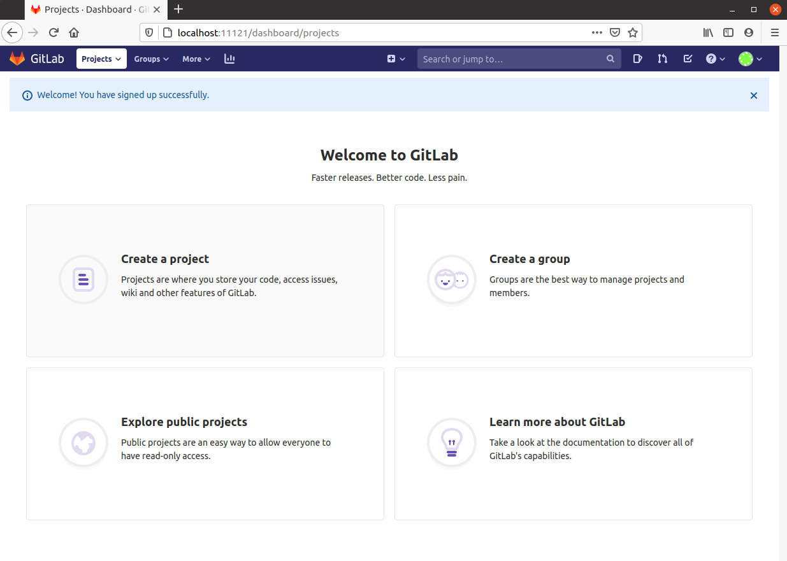
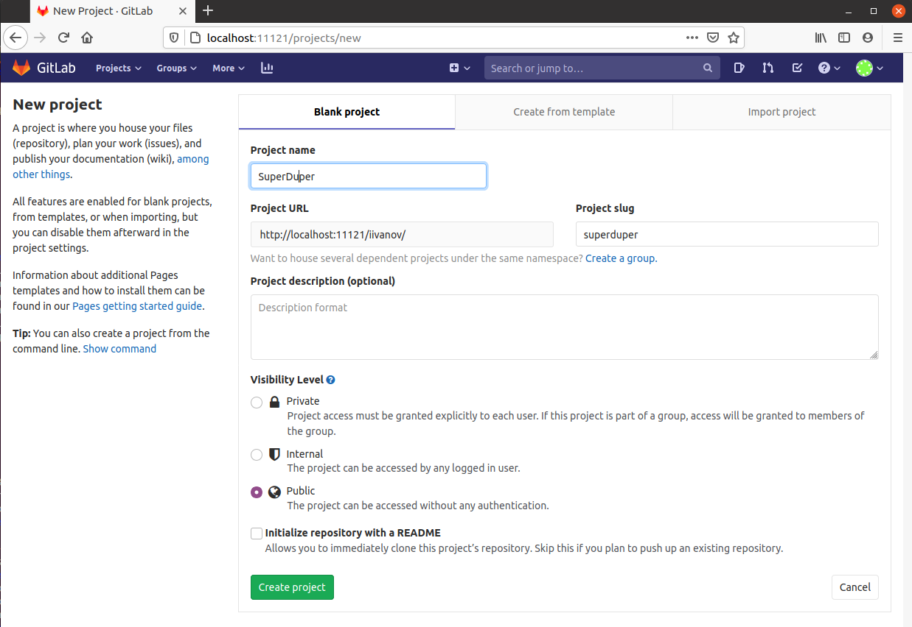

# gitlab - Web UI for git


### Use-cases
- I'm a developer and need quckly to setup git and frontend. No SSL yet.


### Details
It's a docker-compose file containing next services:
```
$ docker-compose ps
           Name                   Command               State                                              Ports                                    
----------------------------------------------------------------------------------------------------------------------------------------------------
dev-factory-gitlab_gitlab_1   /assets/wrapper   Up (health: starting)   0.0.0.0:32768->1342/tcp, 22/tcp, 0.0.0.0:443->443/tcp, 0.0.0.0:11121->80/tcp
```


### Cridentials
Here are no predefined cridentials as such.\
Once you navigate to gitlab page simly register you user and that user has all priveleges, you can add ssh keys and so on.


### Updating /etc/hosts
Here is a tool which uses docker events for updating /etc/hosts.\
Prior to launching docker-compose do this:
```
$ sudo apt update && sudo apt install jq
$ sudo bash ./docker-hosts-update.sh
```
Once this script is run it will append/remove entiries into /etc/hosts


### To launch
```
$ docker-compose up -d --build
```
Ensure /etc/hosts contains records for all containers


### To shutdown
```
$ docker-compose down
```


### To cleanup volumes
```
$ docker volume rm dev-factory-gitlab_gitlab-etc dev-factory-gitlab_gitlab-log dev-factory-gitlab_gitlab-opt
```


### Web services
- [localhost](http://localhost:11121)


### Links
- [Configuration](https://docs.gitlab.com/omnibus/settings/configuration.html)
- [Https setup](https://docs.gitlab.com/omnibus/settings/nginx.html#manually-configuring-https)

### Screenshots

#### Create new user
<p align="center">
    
</p>
<br>


<p align="center">
    
</p>
<br>


#### Create new project
<p align="center">
    
</p>
<br>


<p align="center">
    
</p>
<br>


<p align="center">
    
</p>
<br>

