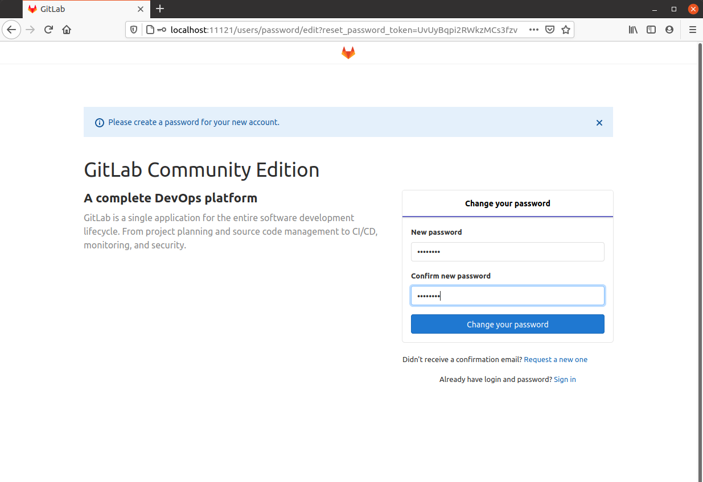
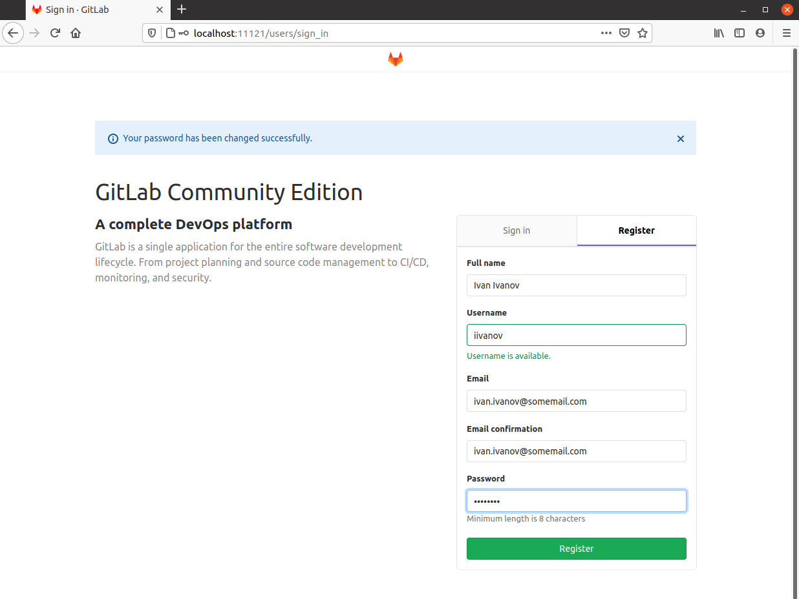
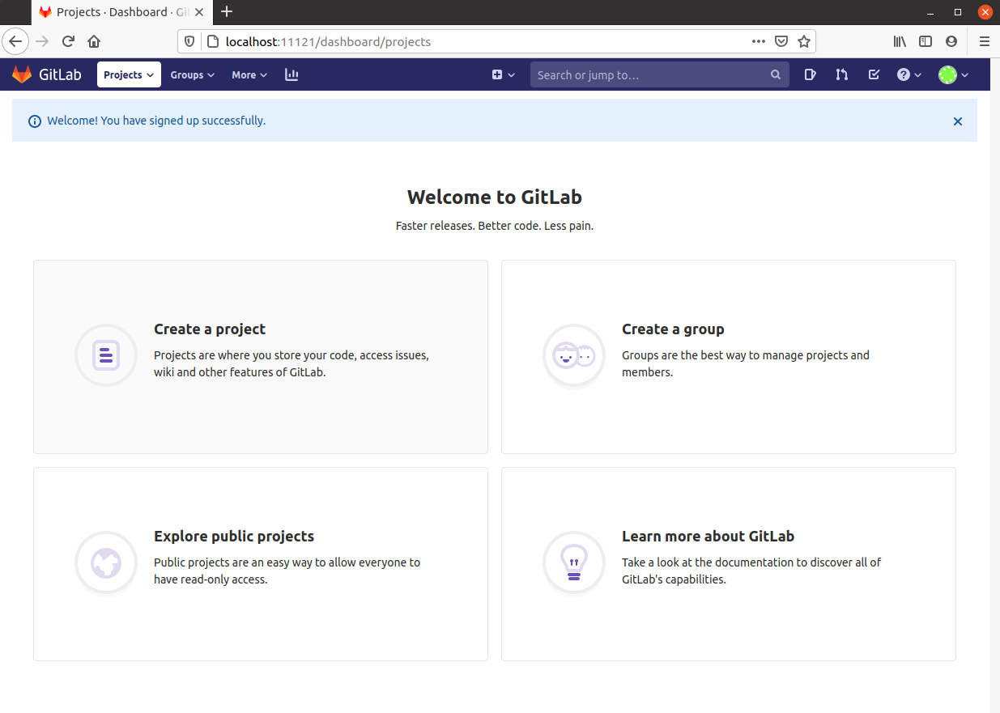
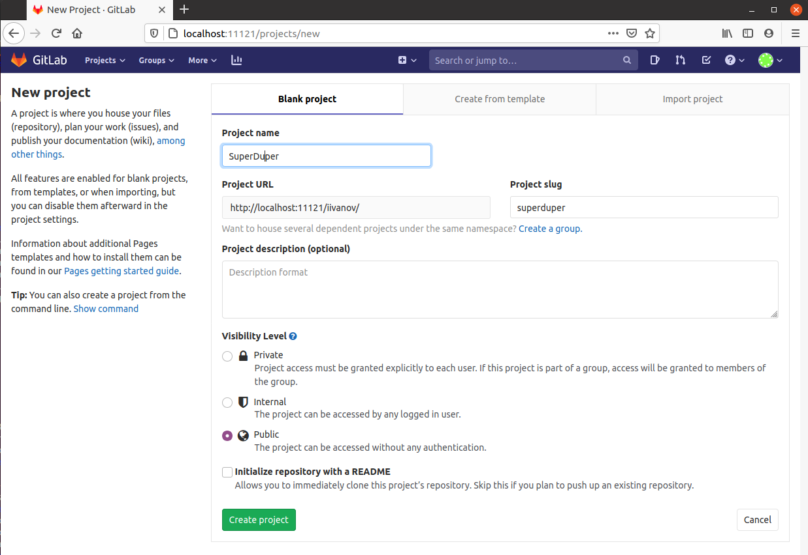
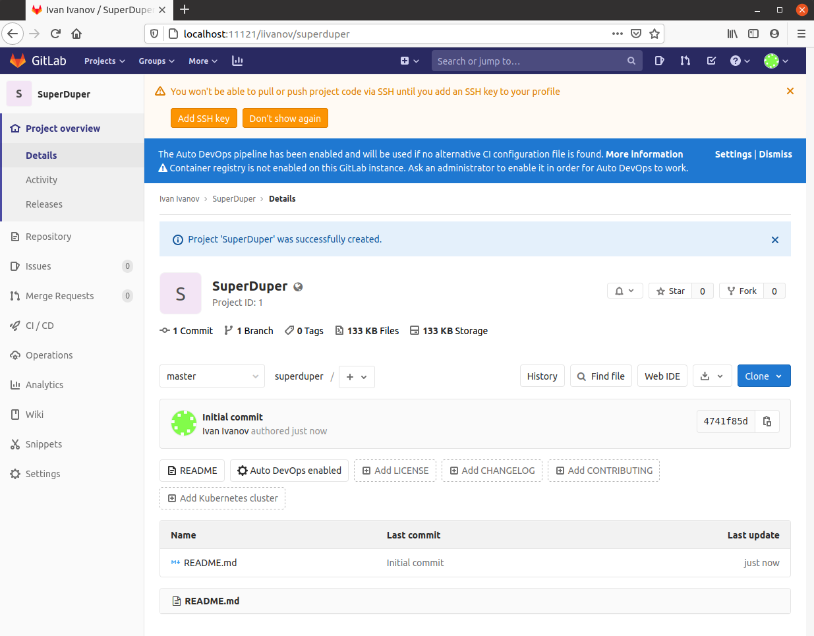

<div align="center">
    
</div>

# Intro 
gitlab itself, i.e git and web UI

---


# Use-cases
- As a developer I need quckly to setup git and frontend. No SSL yet.

<div align="center">
    
</div>

---


### Details
It's a docker-compose file containing next services:
```
$ docker-compose ps
 Name        Command               State                                              Ports                                    
-------------------------------------------------------------------------------------------------------------------------------
gitlab   /assets/wrapper   Up (health: starting)   0.0.0.0:49153->1342/tcp, 22/tcp, 0.0.0.0:443->443/tcp, 0.0.0.0:11121->80/tcp
```

---


### Cridentials
Here are no predefined cridentials as such.\
Once you navigate to gitlab page simly register you user and that user has all priveleges, you can add ssh keys and so on.

---


### Updating /etc/hosts
Here is a tool which uses docker events for updating /etc/hosts.\
Prior to launching docker-compose do this:
```
$ sudo apt update && sudo apt install jq
$ sudo bash ./docker-hosts-update.sh
```
Once this script is run it will append/remove entiries into /etc/hosts


#### Updating /etc/hosts(Option B)
```
$ echo "$(docker exec -it gitlab sh -c "hostname -i" | head -c-2) $(docker exec -it gitlab sh -c "hostname" | head -c-2)" | sudo tee -a /etc/hosts
```

---


### To launch
```
$ docker-compose up
```
Ensure /etc/hosts contains records for all containers

---


### To shutdown
```
$ docker-compose down
```

---


### To cleanup volumes
```
$ docker volume rm dev_factory_gitlab_gitlab-etc dev_factory_gitlab_gitlab-log dev_factory_gitlab_gitlab-opt
```

---


### Web services
- [localhost:11121](http://localhost:11121)

---


### Links
- [Configuration](https://docs.gitlab.com/omnibus/settings/configuration.html)
- [Https setup](https://docs.gitlab.com/omnibus/settings/nginx.html#manually-configuring-https)

---


### Screenshots

#### Create new user
<div align="center">
    
</div>


<div align="center">
    
</div>


#### Create new project
<div align="center">
    
</div>


<div align="center">
    
</div>


<div align="center">
    
</div>

